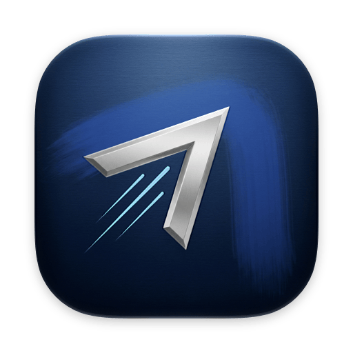
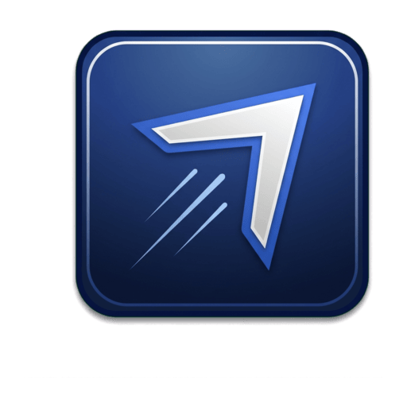
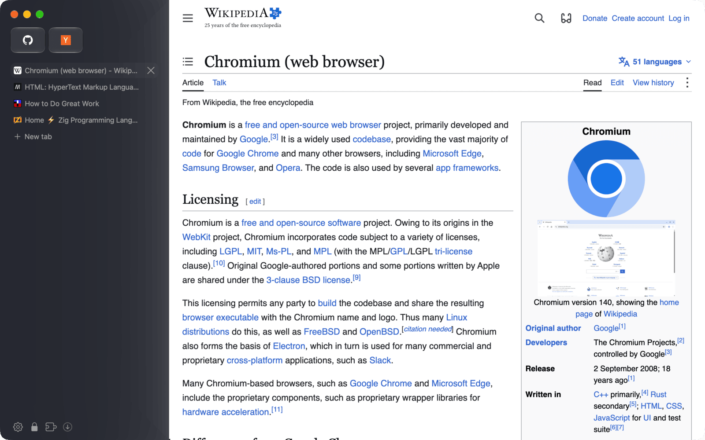
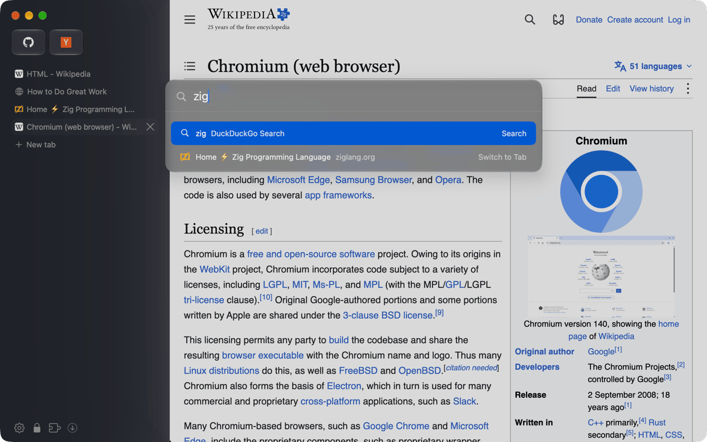
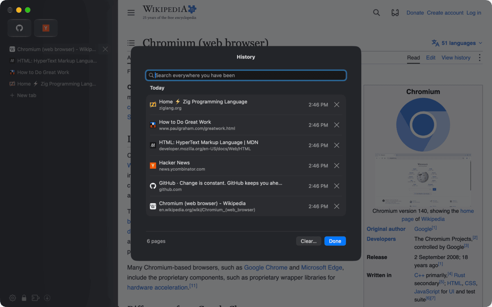
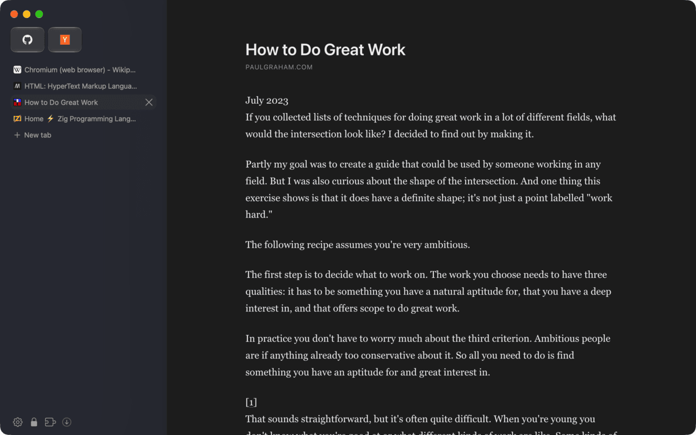

<table align="center">
  <tr>
    <td align="center"></td>
    <td align="center"></td>
  </tr>
  <tr>
    <td align="center">macOS (Icon Composer)</td>
    <td align="center">Linux (Pantheon)</td>
  </tr>
</table>

<h1 align="center">Lynk Browser</h1>

<p align="center">
  <a href="https://github.com/FormalSnake/NativeDesktop"></a>
  <a href="nativedesktop.config.ts"></a>
  <a href="#install"></a>
  <a href="#install"></a>
  <a href="#development"></a>
</p>

A keyboard-first browser in the style of Arc. Tabs sit in a quiet sidebar,
and one command bar takes addresses, open tabs and every action the window has,
so you never reach for a button. Pages render in Chromium through CEF on both platforms. The window
around them is native: every row, field, popover and dialog is a real AppKit or
GTK4 widget drawn by [NativeDesktop](https://github.com/FormalSnake/NativeDesktop),
written in React with no HTML in the interface.



| | |
|---|---|
|  |  |
| The command bar searches what you typed, and offers the open tab below it | History, searchable, one chord away |

## What's in it

| | |
|---|---|
| Two layouts | Sidebar (pinned tiles, tab list, "+ New tab") or a compact row of tabs where the active tab is the address. `Alt+Cmd+S` switches. |
| Command bar | `Cmd+T` and `Cmd+L` rank a completed address, the typed search, open tabs, history, then commands. `Cmd+K` lists tabs by recency, then every command. Typed text always searches first; a matching tab is the row below. Nothing leaves the machine before Return. |
| Pinned tiles | Favicon tiles, or letter tiles as a plainer look. A pinned tab remembers its page and can reset to it. |
| Native panels | History (SQLite), bookmarks and downloads as searchable sheets instead of Chromium's pages. |
| Reading mode | Mozilla Readability over a copy of the page, laid out as a shadow-root overlay. The page underneath is untouched. |
| Floating video | Picture in picture for the page's video, and back with the same chord. |
| Ad blocking | uBlock Origin's default lists, scriptlets and redirects, run by [adblock-rust](https://github.com/brave/adblock-rust) inside the host. It is on by default and can be turned off per site. Elements you hide stay hidden on that site. |
| Extensions | Chromium's own extension runtime. The Chrome Web Store installs straight into the browser. |
| The rest | Session restore with lazily loaded tabs, per-host zoom, find in page with a match count, site permissions held until you look at the tab, a TLS padlock with site settings, a private window on an in-memory profile, DuckDuckGo, Google or Bing. |



## Install

### NixOS

There is no release to download. NixOS installs an image built by
`nd package linux`, pinned in the Nix store by hash. The store copy is
root-owned, and 1Password's browser integration only talks to a browser whose
binary the user cannot write: a copy under `~` (an extracted AppImage,
`AppRun`, a dev build) fails its `BinaryPermissions` check, and the one in
`/nix/store` passes.

```sh
bunx nd package linux     # dist/linux/lynk-browser-0.1.0.AppImage
nix-store --add-fixed sha256 dist/linux/lynk-browser-0.1.0.AppImage
nix hash file --type sha256 --sri dist/linux/lynk-browser-0.1.0.AppImage
```

Then a derivation takes the image with `requireFile` and that hash, unpacks its
squashfs into `$out/opt/lynk-browser`, links `bin/lynk-browser` to `AppRun` and
installs the desktop file and icons. The host binary and `libcef` keep the FHS
loader, so the machine needs `programs.nix-ld`. Tell 1Password about it:

```nix
environment.systemPackages = [ lynk-browser ];
environment.etc."1password/custom_allowed_browsers".text = lib.mkAfter "lynk-browser\n";
```

### macOS and other Linux

```sh
bun install
bunx nd package mac     # dist/mac/Lynk Browser.app, signed with the Developer ID in nativedesktop.config.ts
bunx nd package linux   # dist/linux/AppDir plus an AppImage
```

1Password trusts a browser by its code signature, and an ad-hoc signature
changes with every build, so the mac bundle is signed with a real identity.
Without `appimagetool` the Linux packager writes a bare squashfs instead,
which cannot run directly. Run `dist/linux/AppDir/AppRun` to try the payload.

### Coming from NativeBrowser

The app was called NativeBrowser. `app.previousName` makes the first launch
under the new name rename the old data directory to `lynk`
(`~/Library/Application Support/lynk`, `~/.local/share/lynk`) and, on macOS,
move the Chromium profile to the new executable's. It happens once, and only
when no `lynk` directory exists yet. A host started by hand rather than through
`nd dev` needs `ND_APP_PREVIOUS_NAME=NativeBrowser` for the move.

## Usage

`Cmd` on macOS, `Ctrl` on Linux.

| chord | does |
| --- | --- |
| `Cmd+T` / `Cmd+L` | command bar for a new tab / for this tab's address |
| `Cmd+K` | tab switcher and every command |
| `Cmd+W` / `Shift+Cmd+T` | close tab / reopen it |
| `Cmd+1` to `Cmd+8` | tab by its place; `Cmd+9` is the last tab once there are nine |
| `Shift+Cmd+[` / `Shift+Cmd+]` | previous / next tab (`Ctrl+Shift+Tab` / `Ctrl+Tab` on Linux) |
| `Cmd+S` | show or hide the sidebar |
| `Alt+Cmd+S` | switch layout |
| `Cmd+F`, `Cmd+G`, `Shift+Cmd+G` | find, next, previous; `Esc` closes |
| `Cmd+[` / `Cmd+]` / `Cmd+R` | back / forward / reload |
| `Cmd++` / `Cmd+-` / `Cmd+0` | zoom in / out / reset, remembered per host |
| `Shift+Cmd+R` | reading mode |
| `Alt+Cmd+P` | float video (1Password owns `Shift+Cmd+P`) |
| `Shift+Cmd+H` | hide an element on this site |
| `Cmd+Y` | history (`Ctrl+H` on Linux) |
| `Shift+Cmd+J` | downloads (`Ctrl+J` on Linux) |
| `Alt+Cmd+B` / `Shift+Cmd+B` | bookmarks (`Ctrl+Shift+O` on Linux) / bookmark this page |
| `Cmd+N` / `Shift+Cmd+N` | new window / private window |
| `Cmd+,` | settings |

The table lives in [`src/lib/keys.ts`](src/lib/keys.ts); the menu bar and the
command bar's hints both read it. Commands without a chord (pin, sleep or
duplicate a tab, allow ads on a site, update filter lists) are in `Cmd+K`.

## Development

```sh
bun install
bun run dev    # nd dev: hot reload, the host for this platform
bun test       # 54 unit tests over src/**/*.test.ts
```

Acceptance tests are drives: scripts that launch the real app, talk to it over
the automation socket and assert on the real widget tree. Each prints a marker
when it passes.

```sh
scripts/headless.sh bun scripts/browser-drive.ts   # Linux, NB_MVP_OK
scripts/mac-drive.sh scripts/browser-drive.ts      # macOS against the CEF host
```

`scripts/headless.sh` runs a command under a headless compositor with Adwaita
and its fonts pinned, so a capture never shows the developer's own theme. On
macOS, CEF only runs from an app bundle with its helpers beside it, which
`scripts/mac-drive.sh` assembles from the framework checkout. Only one CEF host
may run on the machine at a time: wrap ad-hoc runs in the framework's
`scripts/mac/cef-gate-lock.sh`. The other drives (sidebar, omnibox, reader,
float, ad blocking, tab drag, session) sit beside it in [`scripts/`](scripts/).
`ND_DRIVE_TIMEOUT_MS` scales every wait when the machine is loaded.

### Icons

The art in [`assets/icon`](assets/icon) was generated through the
[CanaryLLM](https://canaryllm.canarycoders.es) gateway from the prompts in
`prompts.json`, on flat green so it can be keyed:

```sh
bun assets/icon/generate.ts mac-foreground 4          # candidates in assets/icon/candidates/
uv run --with pillow --with numpy python assets/icon/build.py
```

`build.py` keys the chosen originals in `assets/icon/src` into `linux.png` (the
Pantheon tile Linux installs into hicolor) and the two Icon Composer layers that
`nd package mac` compiles into `Assets.car` and an `.icns`, so macOS can draw
them as glass, dark or tinted.

## Credits

Built on [NativeDesktop](https://github.com/FormalSnake/NativeDesktop) and the
[Chromium Embedded Framework](https://bitbucket.org/chromiumembedded/cef). Ad
blocking runs [brave/adblock-rust](https://github.com/brave/adblock-rust) over
[uBlock Origin](https://github.com/gorhill/uBlock)'s lists, and reading mode is
Mozilla's [Readability](https://github.com/mozilla/readability). The sidebar
and command bar take after [Arc](https://arc.net).
